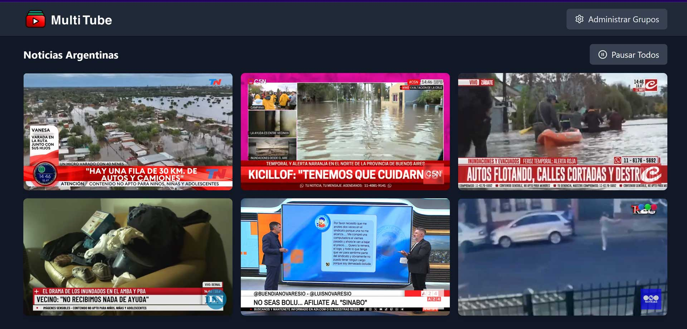

Una app minimalista para agrupar y mirar varios canales de YouTube sin perder la cabeza (ni la paciencia).

👉 [Probar MultiTube Viewer en vivo](https://multitube-viewer.netlify.app/)

## 🚀 ¿Qué es esto?

MultiTube Viewer te permite crear grupos de canales de YouTube, guardarlos y verlos todos desde un solo lugar. Ideal para tus sesiones de info, música, o procrastinación productiva.

## 🛠️ Tecnologías

- ⚡ Vite
- 🧬 React + TypeScript
- 🎨 TailwindCSS
- 🧠 Context API
- 💾 LocalStorage (porque a veces el backend no hace falta)

## 🧪 Scripts útiles

- `npm run dev` – Arranca la app en modo desarrollo 🔥  
- `npm run build` – Empaqueta todo para producción 📦  
- `npm run preview` – Previsualiza el build como en la vida real  
- `npm run lint` – Revisa que no hayas hecho lío 🧼  

## 📸 Captura

